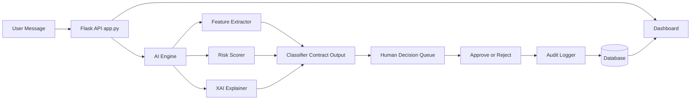

# AI Cyber Human Shield

AI-Augmented Cyber Defense, Human Controlled.

A transparent, explainable, Tunisian-aware threat analysis system that empowers human operators to make informed security decisions.

Hackathon AI x CYBER 2026 Submission | Built for Tunisian Cybersecurity

## Problem Statement

"How can we design an intelligent system to protect Tunisian citizens in cyberspace-capable of detecting, analyzing, and responding to social, financial, and psychological threats-while guaranteeing transparency, data sovereignty, and absolute human control?"

AI Cyber Human Shield answers this by acting as a security co-pilot: it analyzes messages (emails, SMS, social media), detects threats with explainable AI, calculates transparent risk scores, and always requires human validation before any action is taken.

## Key Features

| Feature | Description | Hackathon Alignment |
|---|---|---|
| Multi-Threat Detection | Detects financial phishing, social engineering, psychological manipulation, and safe content | Covers 3+ threat types per PDF |
| Tunisian Context Awareness | Recognizes local banks (BIAT, Attijari), phone formats (+216), and regional scam patterns | 25% Local Impact criteria |
| Transparent Risk Scoring | Weighted formula: (Severity x 40%) + (Confidence x 30%) + (Features x 30%) -> 0-100 score | Zero Black-Box requirement |
| Explainable AI (XAI) | Plain-English explanations: "Risk HIGH because: urgency=3, bank_mention=1, suspicious TLD" | 30% Transparency criteria |
| Human-in-the-Loop | AI proposes (ALLOW/REVIEW/BLOCK), human operator approves/rejects -> zero auto-action | 30% Human Control criteria |
| Full Audit Trail | Every AI prediction + human decision logged with timestamp, IP, and operator name | Total traceability requirement |
| Docker-Ready | Containerized architecture for reproducible deployment | 25% Engineering criteria |

## Architecture Diagram



## Component Responsibilities

| Component | Owner | Purpose |
|---|---|---|
| ai_engine/ | Founoun Dhhibi | NLP pipeline, classification, risk scoring, XAI |
| app.py | Maryem Ghrybi | Flask routes, request handling, API contract integration |
| database.py | Shared | SQLAlchemy models for analyses and audit_logs |
| audit_logger.py | Maryem Ghrybi | Structured logging for traceability |
| templates/ | Maryem Ghrybi | Dashboard UI with real-time stats and decision queue |
| docker/ | Maryem Ghrybi | Containerization for reproducible deployment |

## Quick Start

### Prerequisites

- Python 3.10+
- pip
- Git

### Installation

```bash
git clone https://github.com/founounDhhibi/girlsFmm.git
cd girlsFmm
python -m venv venv
# Windows PowerShell
venv\Scripts\Activate.ps1
pip install -r requirements.txt
python app.py
```

### Test the API

```bash
python -m pytest tests -q
```

### Access the Dashboard

Open: http://localhost:5000/dashboard

## API Contract (Founoun Dhhibi -> Maryem Ghrybi)

The AI engine exposes a single, contract-compliant function through the classifier module.

```python
result = classifier.classify(message)
# Expected keys:
# result["result"], result["confidence"], result["recommendation"],
# result["explanation"], result["features"]
```

### Threshold Logic

| Risk Score | AI Recommendation | Human Action Required |
|---|---|---|
| 0-39 | ALLOW | Optional review |
| 40-69 | REVIEW | Mandatory approve/reject |
| 70-100 | BLOCK | Mandatory approve/reject |

Zero Auto-Action: The system never executes blocking/approving actions without explicit human validation.

## Testing

### Run Contract Validation

```bash
python -m pytest tests/test_contract.py -q
```

Validates contract keys, type safety, range boundaries, and threshold logic across realistic scenarios.

### Simulate Attacks

```bash
python simulations/attack_scenarios.py
```

Runs pre-defined Tunisian-context attack scenarios to demonstrate detection efficacy.

## Adversarial Awareness (Latest)

The MVP now includes a 3-layer adversarial defense path:

- Probe Detection: detects confidence-boundary probing and threshold mapping attempts.
- Confusion Attack Detection: flags contradictory signals designed to evade scoring.
- IP-Aware Rate Monitoring: identifies rapid probing bursts from the same source.

### Anti-False-Positive Improvements

- Short benign text bypass in classifier for low-complexity safe messages.
- Confidence-manipulation detection now requires meaningful risk context.
- French/Tunisian accented letters are excluded from obfuscation counting.

### Run Adversarial Tests

```bash
python -m ai_engine.tests.test_adversarial
```

## Docker Deployment

```bash
docker compose -f docker/docker-compose.yml up --build
```

### Docker Structure

- docker/Dockerfile
- docker/docker-compose.yml

## Transparency Note (Required Deliverable)

### Algorithm Choices

| Component | Technology | Why Chosen |
|---|---|---|
| Classification | HuggingFace facebook/bart-large-mnli (Zero-Shot) | No training data needed, adaptable to new threat types, transparent category definitions |
| Feature Extraction | Rule-based lexicons + regex | Enables XAI traceability, embeds Tunisian context, deterministic behavior |
| Risk Scoring | Weighted formula (40/30/30) | Industry-aligned (NIST/ISO 27005), fully auditable, no hidden weights |
| XAI | Feature-to-evidence mapping rules | Converts technical signals to plain English, satisfies zero black-box |

### Data Provenance and Bias Mitigation

- Training Data: Zero-shot model pre-trained on public NLI datasets (MNLI). No fine-tuning on private user data.
- Lexicons: Curated from Tunisian cybersecurity reports, ANSSI advisories, and local scam databases.
- Bias Handling:
  - Low-confidence predictions (<40%) default to safe but are flagged for human review.
  - Tunisian context rules reduce western-centric false negatives.
  - All decisions are logged for post-hoc bias auditing.

### AI Self-Defense Measures

- Input Sanitization: All user text is sanitized before processing.
- Model Isolation: AI runs locally, with no external API calls.
- Rate Limiting: Flask middleware can restrict abuse of /api/analyze.
- Audit Immutability: audit_logs is append-only in operational policy.

## Team and Contributions

| Member | Role | Key Deliverables |
|---|---|---|
| Founoun Dhhibi | AI Engine Owner | ai_engine module, feature extraction, risk scoring, XAI, contract design |
| Maryem Ghrybi | Workflow and Integration Owner | Flask API, database schema, audit logging, dashboard UI, Docker deployment |

### Collaboration Protocol

- Sync every 4 hours via standup.
- Contract-first development: API schema agreed before coding.
- Git workflow: main (stable), dev (integration), feature branches.

## Project Structure

```text
girlsFmm/
+-- app.py
+-- ai_engine/
�   +-- __init__.py
�   +-- feature_extractor.py
�   +-- risk_scorer.py
�   +-- xai_explainer.py
�   +-- classifier.py
+-- templates/
�   +-- index.html
�   +-- result.html
�   +-- dashboard.html
�   +-- audit_log.html
+-- static/
�   +-- style.css
�   +-- js/
�       +-- main.js
+-- database.py
+-- audit_logger.py
+-- simulations/
�   +-- __init__.py
�   +-- attack_scenarios.py
�   +-- test_cases.json
+-- docker/
�   +-- Dockerfile
�   +-- docker-compose.yml
+-- tests/
�   +-- test_contract.py
+-- requirements.txt
```

## Hackathon Rubric Alignment

| Criteria (Weight) | How We Deliver |
|---|---|
| Human Control and Explainability (30%) | XAI explanations, threshold routing, mandatory human approval, audit logs |
| Engineering Depth and Architecture (25%) | Modular pipeline, contract-first design, Docker, feature engineering |
| Local Impact (25%) | Tunisian bank/phone/scam detection, Darija-aware lexicons, ANSSI-aligned recommendations |
| Innovation and UX (20%) | Risk DNA visualization, human-AI confidence matching, one-click simulation |

## Contact and Support

- Repository: https://github.com/founounDhhibi/girlsFmm
- Issues: use GitHub Issues for bugs or feature requests.
- Demo Video: add your backup recording link.
- Pitch Deck: docs/pitch.pdf

"AI proposes, human disposes. Transparency is the foundation of trust."

## License

Copyright (c) 2026 Securinets FST.
For educational and demonstration purposes only.
Built for a safer Tunisian cyberspace.
